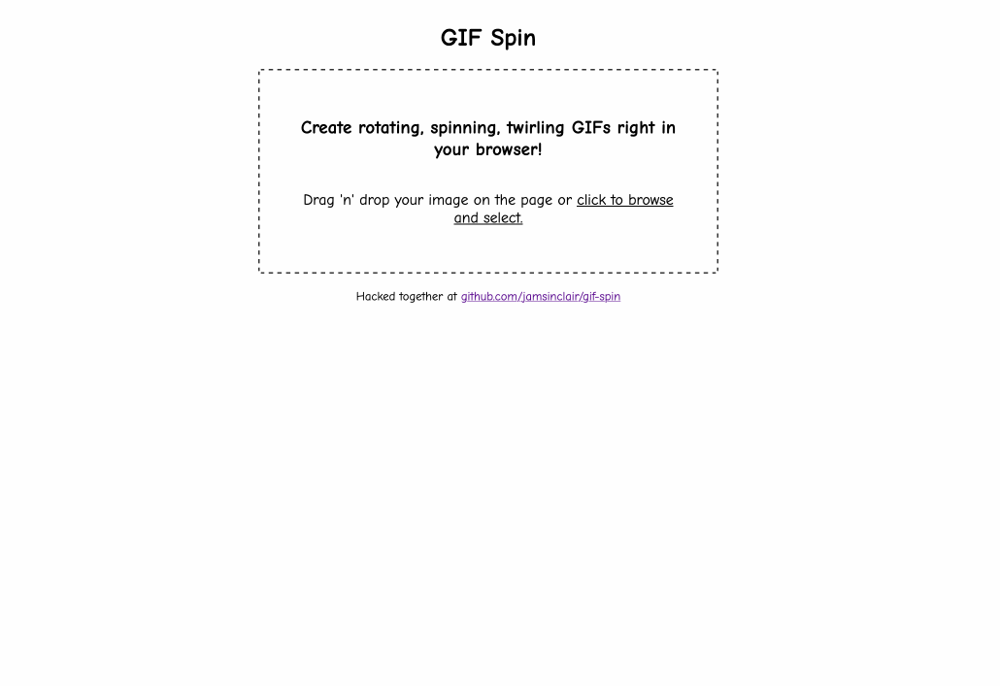

# gif-spin

> Generate spinning gif animations from a static image in your browser!

## Development
1. Clone the repo
1. Run `yarn` to install dependencies
1. Run `yarn dev` to start development server
1. Make your changes?

## Future plans

In an ideal world I would love to see if there is a better gif tool available for the browser. This would greatly improve the size and quality of GIFs created with JavaScript.

Keeping a watch on these projects to see if a wasm version is ever available or feasible:
- https://github.com/kohler/gifsicle (Fork with wasm at https://github.com/marvinirwin/gifsicle-wasm)
- https://github.com/ImageOptim/libpngquant
- https://github.com/ImageOptim/gifski
